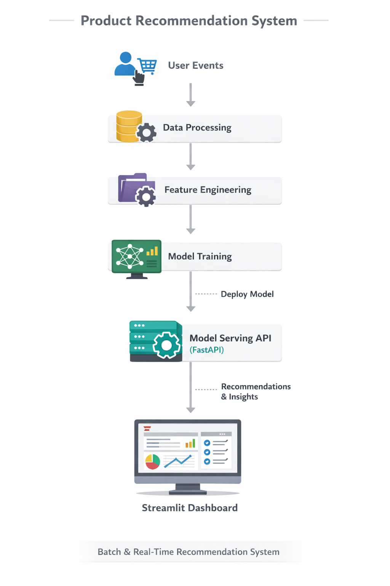

# product-recommendation-system
End-to-end product recommendation system using collaborative filtering, hybrid ML models, and MLOps pipeline with API &amp; dashboard.

# 🛍️ Product Recommendation System (End-to-End ML + MLOps)

---

## 📌 Overview

End-to-end **Product Recommendation System** built using real-world e-commerce interaction data.

👉 Predicts **what a user is most likely to buy next**  
👉 Combines **Collaborative Filtering + Content-Based + Hybrid approaches**  
👉 Designed with **production-grade ML pipeline + API + dashboard**

---

## 🎯 Business Problem

**Core Question:**
> What products should we recommend to each user to maximize engagement, conversion, and revenue?

### Key Challenges:
- Sparse interaction data  
- Cold-start problem (new users/items)  
- Real-time recommendation requirements  
- Scalability for millions of users  

---

## 🚀 Business Impact

- 📈 Increase conversion rate (CTR uplift)  
- 🛒 Improve Average Order Value (AOV)  
- 🎯 Personalized shopping experience  
- 🔁 Improve retention and engagement  

---

## 📊 Dataset

### Primary Dataset:
- **Retailrocket E-commerce Dataset**
  - User events: clicks, add-to-cart, purchases  
  - Product metadata: item IDs, categories  

### Data Fields:
- `user_id`
- `item_id`
- `event_type`
- `timestamp`

---

## 🏗️ System Architecture

  

### 🔄 End-to-End Flow

1. **User Events**
2. **Data Processing**
3. **Feature Engineering**
4. **Model Training**
5. **Model Serving (FastAPI)**
6. **Recommendation Output**
7. **Dashboard (Streamlit)**

---

## 🧠 Recommendation Approaches

### 1. Collaborative Filtering
- User-based similarity  
- Item-based similarity  
- Matrix Factorization (ALS)

### 2. Content-Based Filtering
- Product similarity (TF-IDF / embeddings)  
- Metadata-driven recommendations  

### 3. Hybrid Model (Final)
- Combines collaborative + content features  
- Handles cold-start scenarios  

---

## 📁 Project Structure
